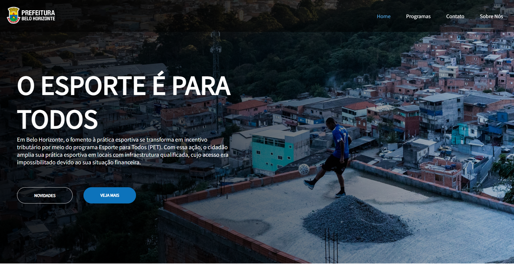

# Trabalho Programação para a Internet - Gabriel Braga

> Site Criado para A Prefeitura de Belo Horizonte, com o objetivo da realização do Trabalho De Programação para a Internet.

### Ajustes e melhorias

O projeto ainda está em desenvolvimento e as próximas atualizações serão voltadas nas seguintes tarefas:

- [X] Aplicar JS
- [X] Melhorar CSS
- [X] Melhorar HTML

## 💻 Link do Site

https://smelbh.000webhostapp.com/
## 🤝 Criador

Criador deste projeto:

<table>
  <tr>
    <td align="center">
      <a href="#">
         
        
          <b>Gabriel Braga</b>
        
      </a>
    </td>
  </tr>
</table>

[⬆ Voltar ao topo](#nome-do-projeto) 
